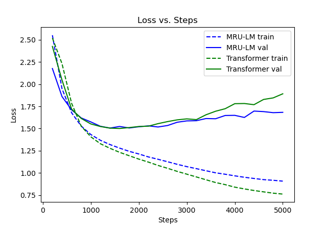

# mru-lm

## How to Run

Use the command `python main.py --device=cuda --dataset=tiny_stories.py`. Set `--dataset=shakespeare_char` for the character-level Shakespeare dataset.

## What is this?

### Introduction

This is a project which replaces attention in a traditional GPT2-based transformer with my idea, the sub-quadratic-complexity matrix recurrent unit (MRU). This repo is forked from my repo transformer-train-script.
Based on testing on the shakespeare_char toy dataset, the MRU seems to work well as a replacement for attention.

The above loss plot is the first train attempt, using the independent-heads branch of this repo and my other repo <https://github.com/mikayahlevi/transformer-train-script>.

### Moving Forward

I have limited compute and experience with training large models, so I haven't been able to test the LM on much other than the toy dataset. Firstly, I would like to test this on larger and more informative datasets. If anyone wants to help me with this or is interested in contacting me, reach out to me at <mikayahlevi@gmail.com>.

I've also began writing [a CUDA PyTorch extension](https://github.com/mikayahlevi/cuda_mru) which can significantly speed up the operation.

### Explanation

#### General Idea

The idea of a matrix recurrent unit is dictated by the update rule $H_t = H_{t-1} X_{t-1}$,  and $H_1 = X_1$ where $X$ and $H$ are $\mathbb{R}^{s \times d_o \times d_o}$ sequences of square matrices ($d_o$ will be clarified later). My motivation for coming up with this idea are based on the following reasons:

- Matrix multiplication is associative but not commutative. The associativity means I can compute the cumulative matrix product using an (inclusive) parallel scan. The lack of commutativity means that the order of the inputs is automatically incorporated into the output by the MRU.
- When you try to do this scan on an traditional RNN, the number of operations scales cubically with the amount of elements in the output state, meaning that limited information is retained compared to the amount of computation. On the other hand, if the states are matrices, the number of operations as a function of elements in the output state is $((d_o)^2)^\frac{3}{2}$, where $(d_o)^2$ is the number of elements in the square $d_o \times d_o$ output matrix state. Some more info here: <https://arxiv.org/abs/1709.04057>.
- When processing the tokens sequentially, the network scales linearly with time in contrast to attention which scales quadratically with sequence length.

### Dimensionality and Construction

#### Dimensions and Computation Complexity

For the rest of this document, let's call the sequence length $s$, the number of heads $h$, the embedding size of the network $d_e$. and the state size of the network $d_s$.
The head size, consequently, is $d_h = \frac{d_s}{h}$.
The matrix state order, or the width/height of the matrix states is $d_o = \sqrt{d_h} = \sqrt{\frac{d_s}{h}}$.
Lastly, the embedding state chunk size is $d_c = \frac{d_h}{d_o}$.

The number of operations for the MRU itself in is:

- Using recurrence

$$
(s) (h) (d_o)^3 = (s) (d_o) (d_s)^\frac{3}{2}
$$

- Using the Brent-Kung scan

$$
2 (s) (h)  (d_o)^3 = 2 (s) (h) (\frac{d_s}{h})^\frac{3}{2}
$$

- Using the Hillis-Steel scan

$$
(log_2 s) (s) (h)  (d_o)^3 = (log_2 s) (s) (h) (\frac{d_s}{h})^\frac{3}{2}
$$

- Using [the CUDA kernel](https://github.com/mikayahlevi/cuda_mru) (Sklansky)

$$
(log_2 s) (\frac{s}{2}) (h)  (d_o)^3 = (log_2 s) (\frac{s}{2}) (h) (\frac{d_s}{h})^\frac{3}{2}
$$

The parallel scans take more computation, but they have the advantage of using parallel hardware more effeciently. While processing recurrently would take $s$ steps on a GPU with infinite cores, the Hillis-Steele and Sklansky scan only takes $log_2(s)$, and the Brent-Kung scan takes $2 log_2(s)$.
The Brent-Kung and Hillis-Steele scans are typically prefix sums, but I repurposed them for cumulative matrix multiplication.

#### Restructuring the Vectors into Matrices and Back

The MRU should take in a sequence of vectors and return a sequence of vectors, like any other traditional operation in a neural network. For now I'll be ignoring the batch and sequence dimensions and only focus on the last dimension. $X$ and $H$ are matrices, so the network somehow has to convert vectors to matrices and back. In this case we will call the $x$ is the input (not the same as $X$) and $y$ is the output. The way $X$ is generated follows this formula:

$$
X = \text{reshape}(x, h, d_o, d_c) W_{in}
$$

$W_{in}$ is a $h \times d_c \times d_h$ tensor, which has the result of essentially matrix-mutliplying each head of $\text{reshape}(x, h, d_o, d_c)$ by a unique weight matrix.
The reshaping chunks the embedding into $d_o$ chunks of size $d_c$.

$y$ is simply generated by the reverse:

$$
y = \text{reshape}(H W_{out}, d_e)
$$

Therefore, $W_{out}$ is a $h \times d_h \times d_c$ tensor, which also has the effect of matrix-mutliplying each head by a unique matrix.

### Comparison with Similar Projects

#### Differences with State-Space Models

Recent developments in state space models have branched out from the Mamba 1 and 2, which use the introduction of selectivity and a reformulation of state space systems to bring them closer to linear attention. Models like Mamba 1/2, RWKV7, and DeltaNet, etc use a significantly reduced state matrix (simply a scalar in the case of Mamba 2) to allow them to avoid the more computationally expensive linear transformations. These changes allow the systems to expressed as computationally effecient weighted sums of vectors (similar to attention). The MRU takes the opposite approach and drops the added terms from state space systems and instead focuses on making the state matrix selective/data-dependent and effecient, so that each update transforms the last state.

#### Theoretical Disadvantage when Compared to Attention and Mamba-Like Models

If we assume that a model can only store an amount of information proportional to the accesible number of scalars, the MRU is shown to have a disadvantage. With attention, it's fair to assume that every value is accessible at every future timestep, meaning that attention can store information proportional to the value size times the sequence length. Mamba-like models also store a large amount information, with a state size by hidden size matrix accessed by a query-like vector at every timestep. Unfortunately, the MRU only has a single square matrix with the number of elements equal to the state size, potentially meaning that the information has to be compressed into a much smaller representation.

### Efficient Scan

For the MRU, I've derived an effecient algorithm using a parallel scan to compute it. Sorry for my (most likely) incorrect mathematical notation. I am not well versed in all of the math fields that this computation involves. Note that the $^T$ symbol refers to transposing the last two dimensions and the $I$ symbol refers to the identity matrix.
The closed form ($1 \leq j \leq s$) for the MRU is

$$
H_j = \prod_{i=1}^{j} X_i
$$

The forward pass can be computed using a parallel scan.

The backwards pass for the MRU way more complicated. $\frac{\partial F(H_j)}{H_j}$ represents output gradient of $H$, or the the partial derivative in respect to the rest of the network and the loss function. The closed form for the partial derivative is

$$
\frac{\partial F(H_j)}{\partial X_i} =
\begin{cases}
\frac{\partial F(H_j)}{\partial H_j} & \text{if } j = i = 1 \\
\frac{\partial F(H_j)}{\partial H_j} \left(\prod_{k=2}^{j} X_k \right)^T & \text{if } j > i = 1 \\
\left(\prod_{k=1}^{i-1} X_k \right)^T \frac{\partial F(H_j)}{\partial H_j} & \text{if } j = i \neq 1 \\
\left(\prod_{k=1}^{i-1} X_k \right)^T \frac{\partial F(H_j)}{\partial H_j} \left(\prod_{k=i+1}^{j} X_k \right)^T & \text{if } j > i \neq 1 \\
0 & \text{if } j < i
\end{cases}
$$

The gradient of $X_i$ is

$$
\nabla X_i = \sum_{j=1}^{s} \frac{\partial F(H_j)}{\partial X_i}
$$

The expanded gradient of $X_j$ is

$$
\nabla X_i = \sum_{j=1}^{s}
\begin{cases}
\frac{\partial F(H_j)}{\partial H_j} & \text{if } j = i = 1 \\
\frac{\partial F(H_j)}{\partial H_j} \left(\prod_{k=2}^{j} X_k \right)^T & \text{if } j > i = 1 \\
\left(\prod_{k=1}^{i-1} X_k \right)^T \frac{\partial F(H_j)}{\partial H_j} & \text{if } j = i \neq 1 \\
\left(\prod_{k=1}^{i-1} X_k \right)^T \frac{\partial F(H_j)}{\partial H_j} \left(\prod_{k=i+1}^{j} X_k \right)^T & \text{if } j > i \neq 1 \\
0 & \text{if } j < i
\end{cases}
$$

If we define $A_{i+1} = H_{i}^T$ and $A_1 = I$, by factoring out $A_i$ the expression can be rewritten like:

$$
\nabla X_i = A_i \sum_{j=1}^{s}
\begin{cases}
\frac{\partial F(H_j)}{\partial H_j} & \text{if } j = i \\
\frac{\partial F(H_j)}{\partial H_j} \left(\prod_{k=i+1}^{j} X_k \right)^T & \text{if } j > i \\
0 & \text{if } j < i
\end{cases} = A_i \sum_{j=i}^{s}
\begin{cases}
\frac{\partial F(H_j)}{\partial H_j} & \text{if } j = i \\
\frac{\partial F(H_j)}{\partial H_j} \left(\prod_{k=i+1}^{j} X_k \right)^T & \text{if } j > i
\end{cases}
$$

I'll call the second part of the gradient a new variable, $B_i$:

$$
B_i = \sum_{j=i}^{s}
\begin{cases}
\frac{\partial F(H_j)}{\partial H_j} & \text{if } j = i \\
\frac{\partial F(H_j)}{\partial H_j} \left(\prod_{k=i+1}^{j} X_k \right)^T & \text{if } j > i
\end{cases}
$$

You can see $B_s = \frac{\partial F(H_s)}{\partial H_s}$. The recurrent form for $B$ is $B_i = \frac{\partial F(H_i)}{\partial H_i} + B_{i+1} X_{i+1}^T$. $B_i$ can also be found with this expression:

$$
\begin{bmatrix}
0 & 0 \\
B_i & I
\end{bmatrix} =
\begin{bmatrix}
0 & 0 \\
B_{i+1} & I
\end{bmatrix}
\begin{bmatrix}
X_{i+1}^T & 0 \\
\frac{\partial F(H_i)}{\partial H_i} & I
\end{bmatrix} =
\begin{bmatrix}
0 & 0 \\
B_{s} & I
\end{bmatrix}
\begin{bmatrix}
X_{s}^T & 0 \\
\frac{\partial F(H_{s-1})}{\partial H_{s-1}} & I
\end{bmatrix}
\begin{bmatrix}
X_{s-1}^T & 0 \\
\frac{\partial F(H_{s-2})}{\partial H_{s-2}} & I
\end{bmatrix} \ldots
\begin{bmatrix}
X_{i+1}^T & 0 \\
\frac{\partial F(H_{i+1})}{\partial H_{i+1}} & I
\end{bmatrix}
\begin{bmatrix}
X_{i+1}^T & 0 \\
\frac{\partial F(H_{i})}{\partial H_{i}} & I
\end{bmatrix}
$$

If we let

$$
U_i = \begin{cases} X_{i+1}^T & \text{if } i \neq s \\
0 & \text{if } i = s \end{cases}
$$

and

$$
L_i = \frac{\partial F(H_i)}{\partial H_i}
$$

then we can express the equation with $B_i$ like:

$$
\begin{bmatrix}
0 & 0 \\
B_i & I
\end{bmatrix} =
\prod_{k=0}^{s-i}
\begin{bmatrix}
U_{s-k} & 0 \\
L_{s-k} & I
\end{bmatrix}
$$

Which can be computed with a reverse parallel scan because matrix multiplication is associative.

Combining all of this, we get the final gradient for the input matrices, $X$, which is $\nabla X_i = A_i B_i$, which can be efficiently computed using a parallel scan and the output of the forward pass.
